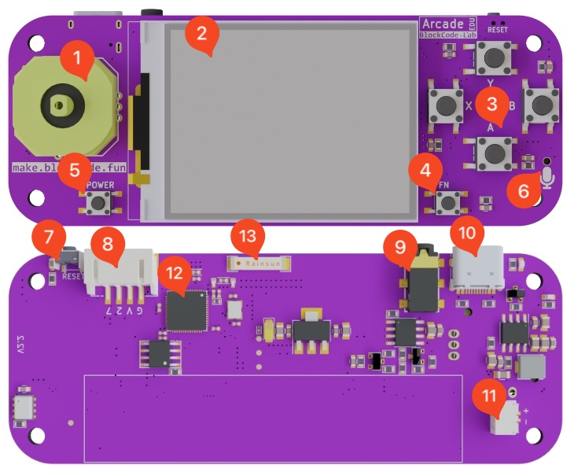

|        | Hardware                       |        | Hardware                         |        | Hardware                   |
| ------ | ------------------------------ | ------ | -------------------------------- | ------ | -------------------------- |
| **1**  | Ultra-thin joystick            | **2**  | 2.0-inch 320×240 HD color screen | **3**  | Game buttons (**A/B/X/Y**) |
| **4**  | Function buttons (**FN/BOOT**) | **5**  | Power button                     | **6**  | MEMS microphone            |
| **7**  | Restart button                 | **8**  | Multi-functional expansion port  | **9**  | 2.5mm headphone jack       |
| **10** | Type-C USB                     | **11** | Battery connector                | **12** | ESP32-S3 chip              |
| **13** | Wi-Fi / Bluetooth antenna      |        |                                  |        |                            |

## Hardware Comparison

|                   | Scratch Arcade Education Edition    | Newbit Technology   Newbit Arcade Shield | Enfu Technology   Biscuit Programming Learning Machine | MakeBlock   Tongxin Pi        |
| :---------------: | ----------------------------------- | --------------------------------------------- | ----------------------------------------------------------- | ---------------------------------- |
|   **Hardware**    |                | 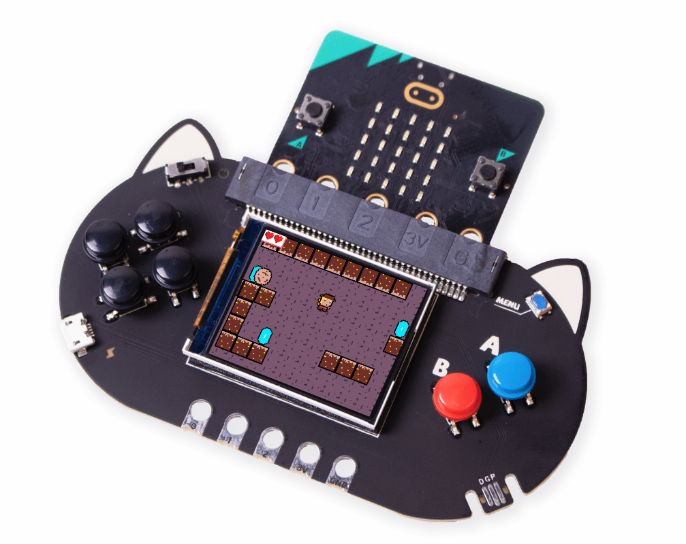              | 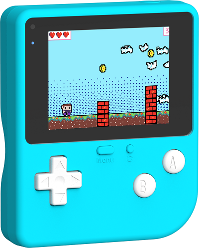                             | 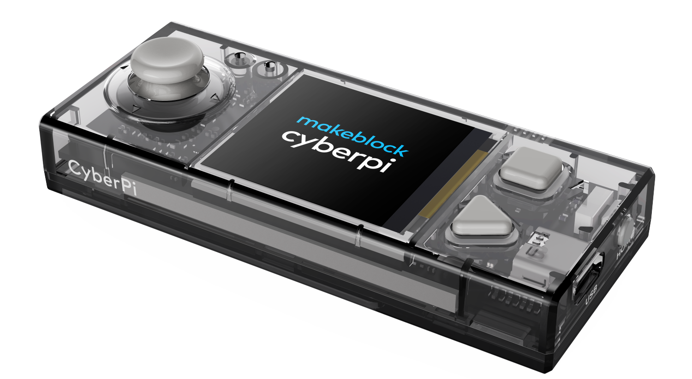         |
|       Chip        | ESP32-S3 Xtensa© Dual-core 240 MHz | micro:bit V2 Mainboard                        | STM32 F42 100MHz                                            | ESP32 Xtensa© Dual-core 240 MHz   |
|      Screen       | 2.0-inch 320×240 HD color screen    | 1.77-inch 160×128 color screen                | 2.4-inch 320×240 color screen                               | 1.44-inch 128×128 color screen     |
|      Network      | 802.11b/g/n Wi-Fi                   | -                                             | -                                                           | Wi-Fi                              |
|     Bluetooth     | Bluetooth 5                         | Built-in micro:bit V2                         | -                                                           | Bluetooth                          |
|      Battery      | 800mAh 3.7v Lithium battery         | 400mAh 3.7v Lithium battery                   | 560mAh 3.7v Lithium battery                                 | 800mAh 3.7v Lithium battery        |
| Direction Control | 4-way joystick                      | Button × 4                                    | Button × 4                                                  | Joystick                           |
|   Game Buttons    | Programming buttons × 5             | Button × 2                                    | Button × 2                                                  | Button × 2                         |
|        USB        | Type-C USB                          | micro USB                                     | Type-C USB                                                  | Type-C USB                         |
|    Microphone     | MEMS microphone                     | Built-in micro:bit V2                         | -                                                           | Microphone                         |
|       Sound       | 2.5mm headphone jack                | Buzzer                                        | Buzzer                                                      | Buzzer                             |
|  Expansion Port   | Universal 2mm 4P expansion port     | Jacdac                                        | Jacdac                                                      | Custom expansion port              |
| Built-in Sensors  | -                                   | Built-in micro:bit V2                         | Light sensor, gyroscope, vibration motor                    | Sensors, gyroscope, RGB lights × 5 |
|       Price       | ¥1xx                                | ¥329 (including micro:bit)                    | ¥298                                                        | ¥169                               |

Here’s the translation while retaining the original format:

## Programming Comparison

|              | Scratch Arcade Education Edition | Xiaomiao Technology   Newbit Arcade Shield | Enfu Technology   Biscuit Programming Learning Machine | MakeBlock   Tongxin Pi |
| ------------ | -------------------------------- | ----------------------------------------------- | ----------------------------------------------------------- | --------------------------- |
| **Hardware** |             |                 |                  |   |
| Graphical    |           | 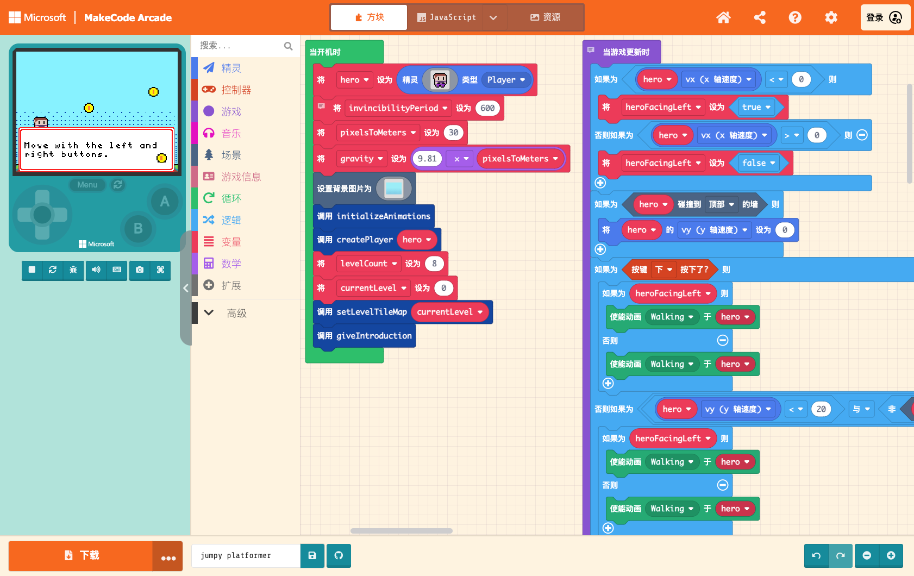                 |                             | 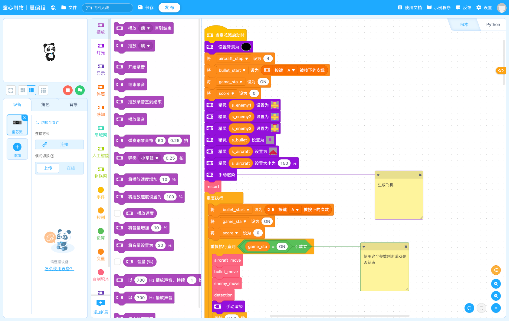   |
| Emulator     | 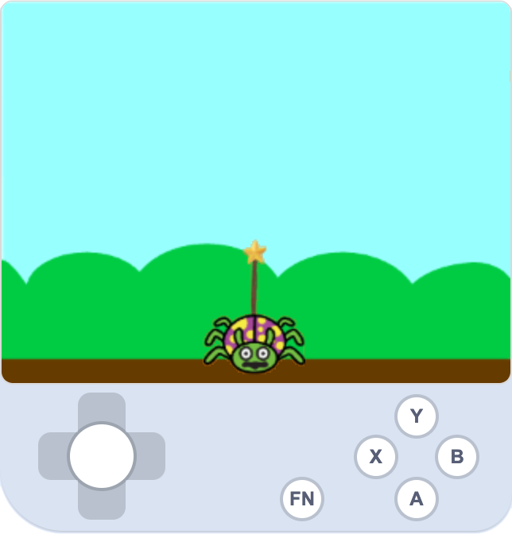    | 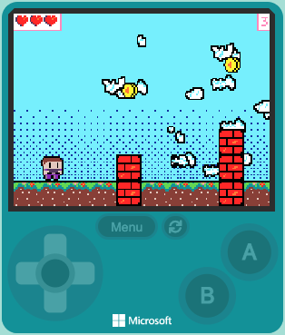       | 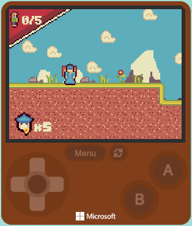                  | null                        |

| Features | A graphical programming environment close to native Scratch, allowing immediate use without additional learning (for teachers and students who have learned Scratch). It adopts a stage + character design model, where what is displayed on the stage appears on the game console screen. Characters can be positioned, sized, and styled directly on the stage, with each character's program controlled independently, making the flow logic clearer. | MakeCode Arcade programming tool, supports graphical programming, lacks the concept of stage and characters, with a single program (all programs combined, not differentiated by character) written together. Sprite (character) coordinates can only be defined through code, lacking intuitive operation. TileMap is a feature that allows for scrollable map effects. | MakeCode Arcade programming tool, supports graphical programming, lacks the concept of stage and characters, with a single program (all programs combined, not differentiated by character) written together. Sprite (character) coordinates can only be defined through code, lacking intuitive operation. TileMap is a feature that allows for scrollable map effects. | A programming tool based on Scratch 2.0, featuring stage and characters, but unrelated to the device screen display, which can only show simple text and graphics. Allows for simple game programming, similar to MakeCode Arcade's development approach, but simplified to only sprites (characters) without TileMap maps. |

## Presentation Effect Comparison

|              | Scratch Arcade Education Edition | Newbit Technology   Newbit Arcade Shield | Enfu Technology   Biscuit Programming Learning Machine | MakeBlock   Tongxin Pi     |
| ------------ | -------------------------------- | --------------------------------------------- | ----------------------------------------------------------- | ------------------------------- |
| **Hardware** | 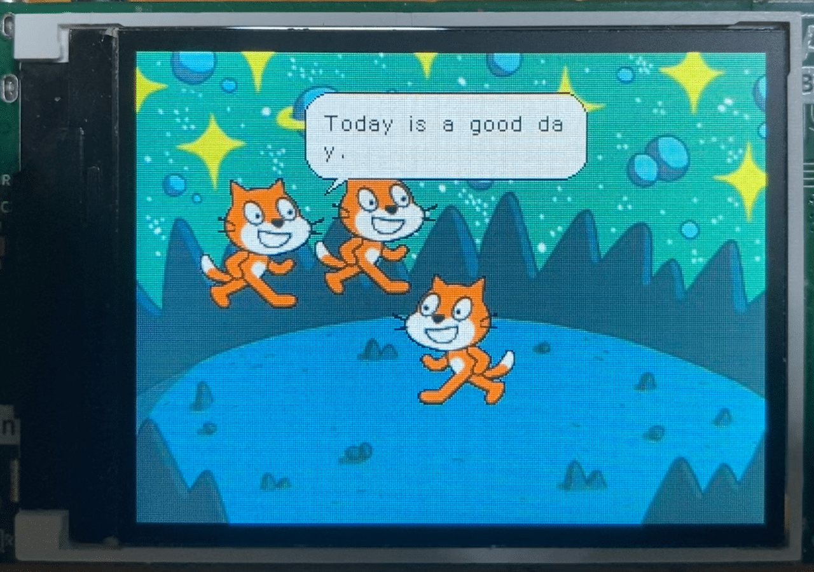   | 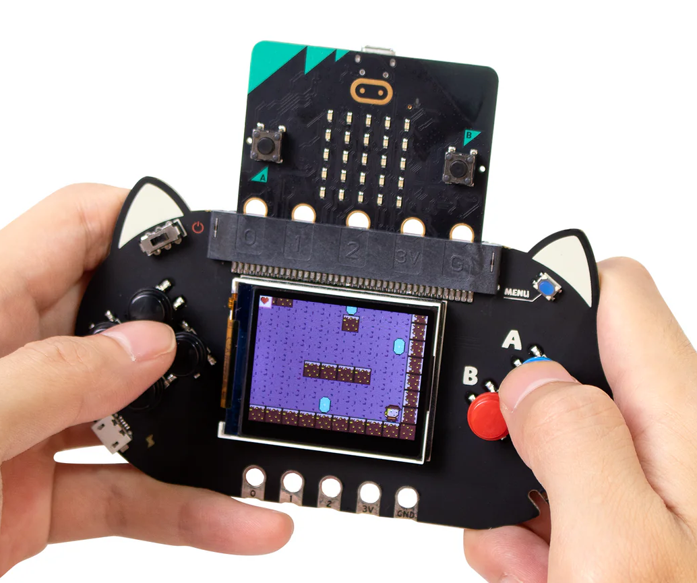         | 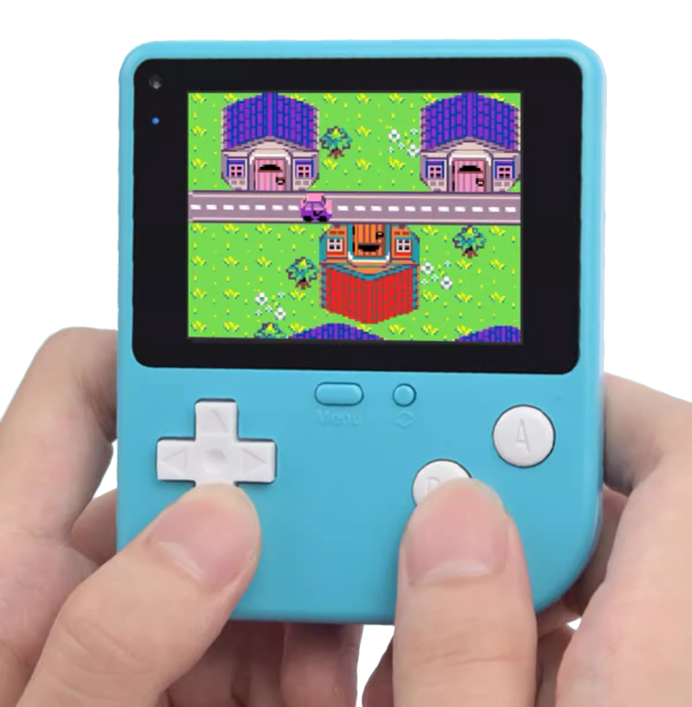                        | 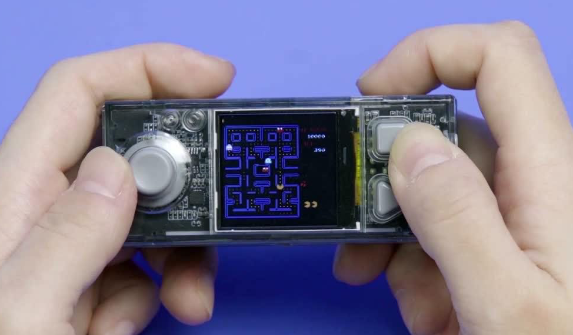 |
