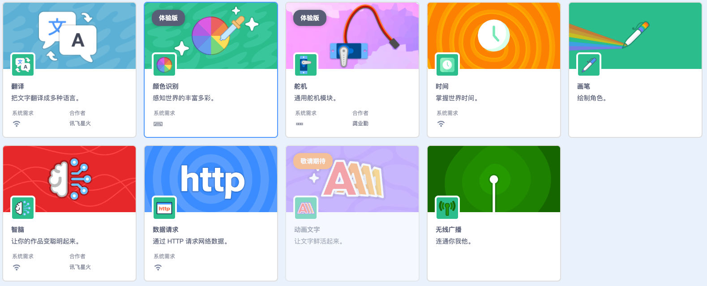

This programmable game console is designed for children's programming. It aims to address the current limitations of the Scratch teaching method, which is currently singular in its approach and lacks hardware integration. These have led to a decrease in student interest.This product will address these shortcomings by enriching teaching content, increasing programming diversity and flexibility, and significantly enhancing students' sense of achievement.Moreover**it will not alter existing teaching materials and can be used straight out of the box**

## Development Story

I have loved playing games since I was young and have been working in game development for over ten years. In 2018, I started exploring Scratch programming for children, initially transitioning from a game developer to an educator in children's programming. Due to my work, I came across the open-source hardware micro:bit and discovered that with a micro:bit V2 and an LCD screen, one could use the MakeCode Arcade graphical tool to develop games. It was astonishing to see that anyone could create and download games into the gaming device using graphical tools. Upon encountering this software, as a traditional game developer, I was amazed. I immediately purchased one from an online marketplace and after playing with it for a while, due to my profession, I noticed some user experience issues.

In MakeCode Arcade programming, all game scenes, backgrounds, and elements are contained within a single main program. Moreover, the controllers are dependent on the hardware of the gaming device, making game programming relatively challenging. Even for someone like me with years of game development experience, it felt a bit convoluted. MakeCode Arcade still retains a shadow of traditional programming in game development. In comparison, Scratch game programming appears much simpler. Common icons and sound elements can be used directly from the built-in options or uploaded from a computer without the need for extensive programming. Different characters can be independently programmed modularly, making it easy for users to understand both the programming framework and concepts.In practical teaching applications, I have validated this point. The teaching difficulty with Scratch is significantly lower than with MakeCode Arcade.

Upon delving deeper into my work, I discovered that most children's programming institutions in China use teaching software and well-known programming platforms like mind+, openblock, mBlock, which are primarily based on modified versions of Scratch. The early users of these platforms predominantly started their journey in children's programming education through Scratch, which is highly popular in China. However, MakeCode Arcade has relatively fewer users in the country. This led me to ponder: could I develop a gaming device that runs Scratch games?

With this idea in mind, I embarked on the following experiments:

Initially, I considered finding hardware capable of running the original Scratch format directly. However, I soon realized that the original Scratch software is resource-intensive in terms of CPU and memory usage. Even on devices like the Raspberry Pi, running Scratch natively is not very efficient. Opting for hardware that can run Linux with a UI system (such as Allwinner/Rockchip solutions) would incur a minimum cost of around 200 RMB. This approach resembled running Scratch on a mobile device, feasible but with high hardware costs. The outcome did not offer significant advantages compared to developing a simple mobile app.
Subsequently, I conceived a second approach where the device doesn't execute the native Scratch application. Instead, I aimed to create a program capable of parsing and running sb3 format files, inspired by the Scratch source code. However, a challenge arose. Apart from program execution, original Scratch contains various elements, icons, and resource files. These resource files, totaling several tens of megabytes, would need to be pre-installed on the hardware. Any modifications to these resources on the host device would necessitate firmware updates on the target device for synchronization. Moreover, this approach still demanded high hardware memory requirements, and developing such software proved to be quite challenging.

Through the previous two rounds of deliberation and analysis, I have redefined the requirements and made some adjustments, outlining the core needs:

- The hardware should ideally be mainstream open-source hardware with a Bill of Materials (BOM) cost under 100, facilitating production, replication, strong compatibility for firmware development, and feature expansion.
- Since the favored programming method is Scratch-like, such as mBlock, mind+, and ScratchCat etc, where users can quickly adapt, we aim to maintain the Scratch programming style as much as possible, without insisting on running the native Scratch format.

With this summary in mind, I swiftly found inspiration in the micro:bit board simulator within the MakeCode software. Recognizing that the Scratch stage essentially functions as a simulator, I realized that my hardware's game running does not necessarily require native Scratch sb3 files. I can define my game running method and then rewrite a corresponding simulator in Scratch software to replace the original Scratch stage. This way, apart from some changes in the Scratch stage compared to the native version, everything else remains almost identical.

To realize these ideas, I created a new Scratch framework from scratch (as the original Scratch framework was no longer suitable for expansion, prompting me to build a new one from the ground up) - I named it the **BlockCode framework**. At the time, I had a Pico:ed board hardware based on the RP2040 controller. Hence, within the **BlockCode framework**, I implemented the functionality to simulate the buttons and display features of the Pico:ed board.

However, since we are going to create a game, we definitely need a screen. Therefore, I designed a hardware based on the RP2040 with an LCD screen (self-taught in hardware design, this is my first PCB layout).

At the time the project was also open source[https://gon.gyeq.in/#/2023/0617/](https://gon.gyeq.in/#/2023/0617/)，but now it's been deleted.

When using the RP2040 as the main controller, I soon encountered a new issue. With a main frequency of only 133 MHz, the RP2040 struggled a bit with image refreshing. Additionally, there isn't much open-source documentation available for peripheral expansion, making it challenging to add new features. Therefore, I shifted my focus to the ESP32-S3, which has a main frequency of 240 MHz and offers ample expandable features with WiFi and Bluetooth support. I then redesigned new hardware based on the ESP32-S3:

After six months, I basically achieved the core functionalities, but it still didn't resemble a game console. So, I increased the size of the LCD screen and redesigned it to look more like a game console, ultimately resulting in the open-source version you see today. In fact, the entire development and validation process took a year and a half, involving numerous technical details and challenges, including the following:

1. The programming method needed to remain fully compatible with the native Scratch, using an emulator to replace the stage.
1. The game execution flow and the LCD screen refresh rate on the microcontroller.
1. Networking capabilities, recording functionality, and sound playback needed to be implemented on the game console.
1. The ability to open sb3 game format files.
   To pay tribute to the classic and powerful platforms MakeCode Arcade and Scratch, this game console is named—

# Scratch Arcade

## Product Characteristics

|                | Open Source Version                                                       | Maker Version                                           | Educational Version                                                               | Professional Version                         |
| -------------- | ------------------------------------------------------------------------- | ------------------------------------------------------- | --------------------------------------------------------------------------------- | -------------------------------------------- |
| **Chip**       | ESP32-S3                                                                  | ESP32-S3                                                | ESP32-S3                                                                          | ESP32-P4 + ESP32-C6                          |
| **Storage**    | 8MB flash   8MB PSRAM                                                | 8MB flash   8MB PSRAM                              | 8MB flash   8MB PSRAM                                                        | 16MB flash   16MB PSRAM                 |
| **Screen**     | 2.0 inch   320×240 HD Color Screen                                   | 2.0 inch   320×240 HD Color Screen                 | 2.8 inch   320×240 HD Color Screen                                           | TBD High-Definition True Color Screen        |
| **Touch**      | None                                                                      | None                                                    | None                                                                              | Capacitive Touch                             |
| **Network**    | 802.11b/g/n Wi-Fi   Bluetooth 5 (LE)                                 | 802.11b/g/n Wi-Fi   Bluetooth 5 (LE)               | 802.11b/g/n Wi-Fi   Bluetooth 5 (LE)                                         | 802.11b/g/n Wi-Fi   Bluetooth 5 (LE)    |
| **Battery**    | None                                                                      | 800mAh 3.7V Lithium Battery                             | 800mAh 3.7V Lithium Battery                                                       | TBD                                          |
| **Buttons**    | Programmable Buttons × 9                                                  | Ultra-thin Joystick × 1   Programmable Buttons × 5 | Ultra-thin Joystick × 1   Programmable Buttons × 5                           | Joystick × 2   Programmable Buttons × 9 |
| **Microphone** | None                                                                      | MEMS Microphone × 1                                     | MEMS Microphone × 1                                                               | MEMS Microphone × 1                          |
| **Sound**      | Speaker × 1                                                               | Speaker × 1                                             | None                                                                              | Speaker × 1                                  |
| **Interface**  | Type-C USB × 1                                                            | Type-C USB × 1   4P-PH2.0 Expansion Port × 1       | Type-C USB × 1   4P-PH2.0 Expansion Port × 1   2.5mm Headphone Jack × 1 | Type-C USB × 1   Expansion Port TBD     |
| **Sensors**    | None                                                                      | None                                                    | Several External Sensors for Education                                            | Built-in Multiple Sensors                    |
| **Size**       | 100mm × 38mm                                                              | 100mm × 38mm                                            | TBD                                                                               | TBD                                          |
| **Links**      | [Lichuang Open Hardware Platform][1]   [GitHub][2]   [Gitee][3] | Taobao                                                  | Contact Customer Service                                                          | TBD                                          |

### Screen

The **2.0 inch** TFT HD color screen supports up to **65,536** rich colors (16-bit color) with a resolution of **320×240** pixels, capable of presenting an expansive game stage. Combined with TileMap (coming soon), it enables the creation of a vast 2D game world.

### Network

The powerful networking capabilities of the ESP32-S3 support 802.11b/g/n Wi-Fi and Bluetooth 5 (LE). Coupled with network AI services, it easily enables functionalities such as voice recognition (using the onboard microphone), image recognition (using a camera for transmission), smart home integration, and intelligent campus applications. **Multiple game consoles can also achieve interconnectivity for online interaction.**

### Interaction

Featuring an ultra-thin joystick or directional buttons (**⇧/⇩/⇦/⇨**), game buttons (**A/B/X/Y**), and function buttons (**Fn**). By programming, the joystick and buttons can be assigned different functions, enabling various gameplay styles and enriching program interaction capabilities. They can also serve as a **remote control** to manage other devices via the Internet of Things (coming soon).

The onboard MEMS microphone allows for real-time audio recording, enabling voice control, voice recognition, and AI dialogue functionalities when combined with network capabilities.

### Interface

- The **Type-C USB** interface is used for charging and program downloads.
- The **2.5mm headphone jack** allows for headphone connection to listen to music, avoiding noise during teaching as there is no external speaker (horn).
- The **multi-functional expansion port** enables the connection of more peripheral hardware modules, such as general-purpose servo modules, ultrasonic modules, color recognition modules, etc., enriching the interactivity and functionality of game programs.

## Programming

Use graphical (Scratch) or MicroPython programming in [BlockCode Playgrounds](https://make.blockcode.fun/).

### Graphical (Scratch)

The interface is identical to Scratch, and most of the programming block modules are the same. A few differences exist due to hardware characteristics (missing features will gradually be added in the future to align more closely with the original Scratch block modules and functions), making it easier for teachers familiar with Scratch to conduct lessons.

The extension modules vary significantly, offering more control modules related to hardware (requiring the connection of corresponding peripherals) and AI modules.

|            | Differences                                                                                                                                                                                                                                                                                                                                                                                                              |
| ---------- | ------------------------------------------------------------------------------------------------------------------------------------------------------------------------------------------------------------------------------------------------------------------------------------------------------------------------------------------------------------------------------------------------------------------------ |
| Stage      | The aspect ratio remains consistent with the original Scratch, but the resolution has been reduced to 320×240, with x coordinates ranging from -160 to 160 and y coordinates from -120 to 120.  Variables are not displayed; the content of variables will be shown in the new “Data Monitoring” panel (coming soon).  To display more text (or lists) on the stage, the “Animated Text” extension can be used. |
| Costumes   | Costume resources are only in bitmap mode and do not support vector graphics mode; costumes from Scratch can still be used.                                                                                                                                                                                                                                                                                              |
| Background | In addition to bitmap backgrounds from Scratch, **TileMap backgrounds** and **AI backgrounds** are also supported.  **TileMap backgrounds** are used to create large game maps with tiles; **AI backgrounds** use generative AI to produce bitmap backgrounds through text input.                                                                                                                                    |
| Sound      | Only wav format sound files can be used. (Currently, sound playback is only available in the emulator.)                                                                                                                                                                                                                                                                                                                  |
| Blocks     | Currently lacking special effect blocks and color collision blocks from Scratch.  “Date and Time” related blocks have been changed to “Time” extension and require a Wi-Fi connection to access.  Custom blocks are not yet available. (coming soon)  The stage will also have motion blocks to control movement on **TileMap-type backgrounds**. (coming soon)                                           |

#### Extensions

Achieve more imaginative ideas through a rich array of extensions. The extensions cover various aspects including graphics, data, algorithms, sensors, (motor) actuators, AI, and more. Additional extensions will be released in the future.

### MicroPython

The firmware is compiled based on the latest MicroPython 1.2x version, with added unique packages to facilitate the development of games and mini programs.

!> MicroPython Programming platforms stay tuned.

[1]: https://oshwhub.com/blockcodelab/arcade_lite
[2]: https://github.com/BlockCodeLab/arcade-lite
[3]: https://gitee.com/blockcodelab/arcade-lite
