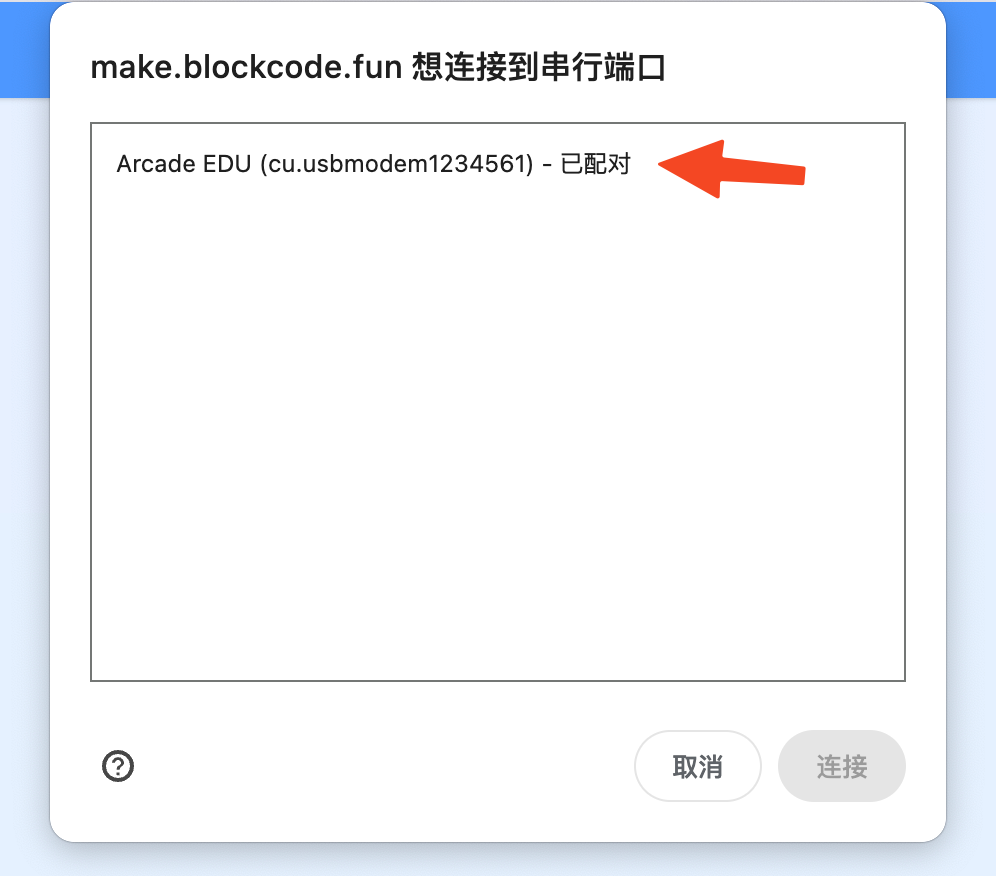
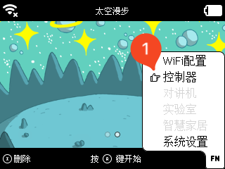
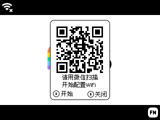
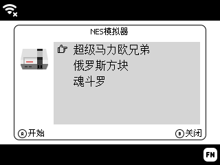
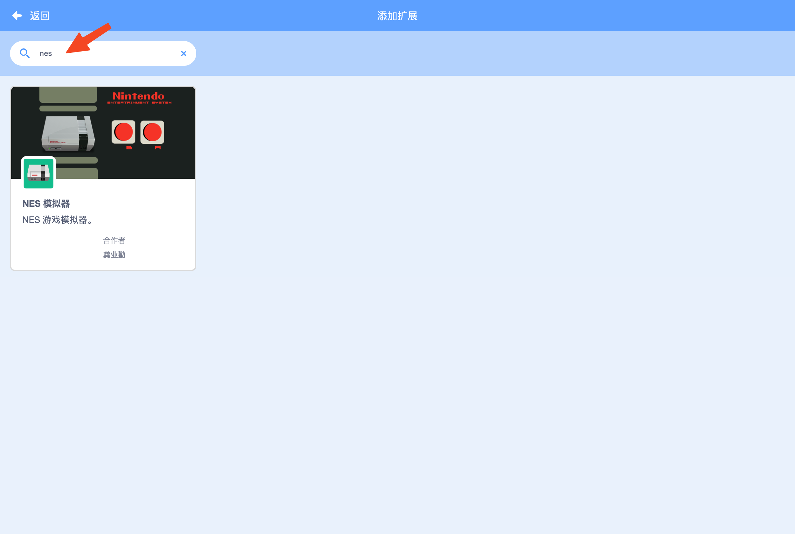
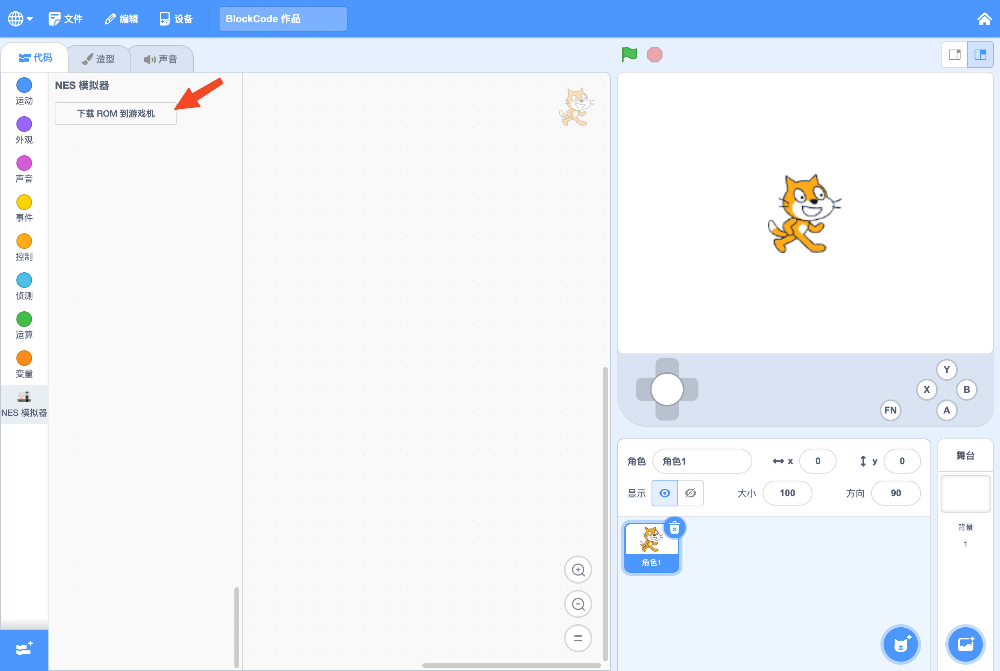

This is an operating system designed for Arcade(https://arcade.blockcode.fun/), which will also serve future product series.This operating system provides basic project program management and system functionality.

!> The system software features frequent updates and iterations, with differences in functionality for different hardware versions. This video serves only as a demonstration of the operating system's effects.

## Features

- **System Integration**: Integrates multiple subsystem functionalities.
- **User-Friendly Operation**: Makes full use of various buttons with an intuitive and straightforward operation method.
- **Project Management**: Allows for operations such as deleting and running projects.

## System Interface Operations

|       | Function                                                                                                      |
| ----- | ------------------------------------------------------------------------------------------------------------- |
| **1** | System LOGO; displays the project background image when a project exists                                      |
| **2** | Network connection status icon (not connected/connected)                                                      |
| **3** | Current time (will display only after connecting to the network)                                              |
| **4** | Battery level or charging status icon                                                                         |
| **5** | System menu key prompt icon; press **FN key** to display [System Menu](#%E7%B3%BB%E7%BB%9F%E8%8F%9C%E5%8D%95) |

### Manage

After powering on, the system operation interface is displayed, where users can manage their downloads.

|       | Function                                                                                                                      |
| ----- | ----------------------------------------------------------------------------------------------------------------------------- |
| **1** | Current project background image                                                                                              |
| **2** | Current project name                                                                                                          |
| **3** | Multi-project page navigation prompt; switch projects using **⇦ key** or **⇨ key**                                            |
| **4** | [Delete Project](#%E5%88%A0%E9%99%A4%E4%BD%9C%E5%93%81) operation prompt; press **X key** to delete the current project       |
| **5** | [Run Project](#%E8%BF%90%E8%A1%8C%E4%BD%9C%E5%93%81) operation prompt; press **A key** to immediately run the current project |

#### Download

Users can complete the download of their programming projects using the online programming tool [BlockCode Playgrounds](https://make.blockcode.fun/). First, start a new project titled “Scratch Programming Learning Machine” (or open a previously saved project) to enter the graphical programming tool interface.

First, use a Type-C data cable (it must be a cable that supports data transfer, not just a charging cable) to connect the computer and the device. Then, click on the “Menu” and select the first item in the “Device” menu—“Download Program”—

In the pop-up device list window, select your device—“Arcade EDU (xxxxx)”, then click to connect and wait for the program download to complete. The entire download process may take varying amounts of time depending on factors such as the number and size of resources used by the program, ranging from a quick ten seconds to one to two minutes. However, after the initial download is complete, updating the program will significantly shorten the download time, as resources and programs that have not changed will not be re-downloaded; only new resources and programs will be downloaded.

Once the download is complete, the device will restart, and you can then choose to run your own game. If you named the program before downloading, this name will be displayed at the top of the screen during selection. For specific device operations, you can refer to the “[User Manual](/en/os.md)”.

#### Delete

Press the **X key** to display the delete confirmation dialog. Then press the **A key** to confirm the deletion, or press the **B key** to cancel the deletion and return to the main interface (project display management).

#### Run

On the main interface, press the **A key** to run the currently displayed project. After pressing the **A key**, wait for the project to load completely.

### System Menu

System sub-functions need to be accessed by pressing the **FN key** to bring up the system menu and then making a selection. More practical system functions will be added in the future.

|       | Function                                                                          |
| ----- | --------------------------------------------------------------------------------- |
| **1** | Current selected menu item prompt; switch selections using **⇧ key** or **⇩ key** |
|       | Press **A key** to enter the selected menu item function                          |

### Wi-Fi Configuration

Using SmartConfig technology, quickly set up the network for [Arcade](https://arcade.blockcode.fun/) to connect to the internet. After entering the Wi-Fi configuration, simply scan the QR code with WeChat to start the network configuration. The network only supports **2.4G networks**.

Scan the QR code above with WeChat, then fill in the network name and password on the opened webpage and confirm to start the network configuration. Meanwhile, press the **A key** on the [Arcade] and wait for the configuration to complete. If the configuration times out, press the **B key** to restart the network setup.

!> Being closer to the router can improve the success rate of the network configuration.

Once configured, the network information will be saved, so you won’t need to set it up again next time; it will connect to the network automatically upon powering on. After connecting, the system will automatically retrieve the current time and display it in the upper right corner. You can also configure the automatic connection and time display settings, allowing you to enable or disable these options in the system settings or after connecting to the network.

| Setting         | Description                                                                                                                                            |
| --------------- | ------------------------------------------------------------------------------------------------------------------------------------------------------ |
| Auto Connect    | Automatically connect to the last used network on startup; if the network is unavailable, it will not connect. (Default: ON)                           |
| 12-Hour Format  | Display the current time in 12-hour format. (Default: OFF, displays time in 24-hour format)                                                            |
| Local Time Zone | Adjust the time zone, which will affect the displayed time. (Defaults to the time zone of the primary language region, e.g., Simplified Chinese is +8) |
| Reset Network   | Disconnect from the current network and delete saved network information.                                                                              |

!> You can also set up the network for [Arcade](https://arcade.blockcode.fun/) on your computer via [BlockCode Playgrounds](https://make.blockcode.fun/), and it will connect to the configured network after downloading the program.

### System Settings

Set the volume, screen brightness, automatic connection, and other personalized settings for [Arcade](https://arcade.blockcode.fun/).

Here’s the translation:

| Setting            | Description                                                                                                                                                  |
| ------------------ | ------------------------------------------------------------------------------------------------------------------------------------------------------------ |
| Display Brightness | Adjust the brightness of the display. (Default: 3)                                                                                                           |
| Volume Level       | Adjust the volume level. (Default: 3; muted at 0)                                                                                                            |
| Auto Run           | Automatically run the latest downloaded program on startup. Press and hold the **B key** during startup to skip auto-running and enter the system interface. |
| Auto Connect       | Automatically connect to the last used network on startup; if the network is unavailable, it will not connect. (Default: ON)                                 |
| 12-Hour Format     | Display the current time in 12-hour format. (Default: OFF, displays time in 24-hour format)                                                                  |
| Local Time Zone    | Adjust the time zone, which will affect the displayed time. (Defaults to the time zone of the primary language region, e.g., Simplified Chinese is +8)       |

### Controllers

Here’s the translation:

#### Mode One (In Testing)

Use [Arcade](https://arcade.blockcode.fun/) as a computer controller to control Scratch games (or other games) on the computer.

#### Mode Two (Planned)

Utilize the networking capabilities to make [Arcade](https://arcade.blockcode.fun/) a wireless controller that can display video transmission and remote control devices. Simply point the device's camera at the screen to scan, and the network configuration will be completed automatically. Once the configuration is successful, [Arcade](https://arcade.blockcode.fun/) will display the image captured by the camera.

### AI Walkie-Talkie (Planned)

Voice functionality implemented using the built-in microphone of [Arcade](https://arcade.blockcode.fun/).

#### Mode One (Planned)

Wireless intercom functionality for multiple devices over short distances.

#### Mode Two (Planned)

AI voice assistant that combines a large AI language model, allowing direct voice queries for information, translations, inquiries, and more.

### Laboratory (Planned)

In the laboratory, achieve various sensor and motor calls through parameter configuration, allowing for intuitive retrieval of sensor values on [Arcade](https://arcade.blockcode.fun/).

### Smart Home (Planned)

Make [Arcade](https://arcade.blockcode.fun/) a wireless controller for smart home devices, allowing control of all smart appliances in the home.

---

（click here for easter egg）

## Hidden Feature

Finally, there's an Easter egg! You may have noticed in the initial animation that there is an “NES Emulator” in the **FN menu**, but it wasn’t introduced! Did you see it wrong? You didn't see it wrong; there is indeed an NES emulator feature. However, as a programming learning machine, this is just a little surprise for everyone. This feature will only be activated by uploading NES games through [BlockCode Playgrounds](https://make.blockcode.fun/).

Create a new **Scratch Arcade** project in [BlockCode Playgrounds](https://make.blockcode.fun/), then add an extension. In the extension search bar, enter “**nes**” (it must be the complete three letters) to view the “NES Emulator” extension. Once added, it will appear in the blocks palette.在[BlockCode Playgrounds](https://make.blockcode.fun/)

 

This extension does not have any blocks; it only has a button labeled “Download ROM to Console.” After clicking the button, connect to Arcade and select the game ROM you want to play. You can then open the “NES Emulator” in the **FN menu** and select the newly downloaded game ROM to start playing. Note that the button mappings for the “NES Emulator” differ slightly from the original key layout:

| NES Key    | Arcade Key |
| ---------- | ---------- |
| ⬆         | ⇧          |
| ⬇         | ⇩          |
| ⬅         | ⇦          |
| ⮕          | ⇨          |
| **A**      | **B**      |
| **B**      | **A**      |
| **START**  | **FN**     |
| **SELECT** | **X**      |
| **RESET**  | **Y**      |

!> Please find and download game ROMs on your own or consult customer service.

