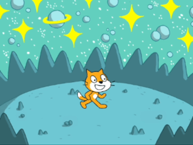
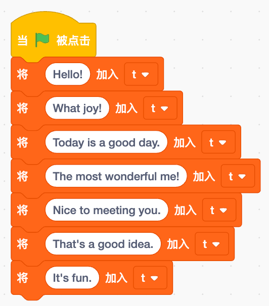
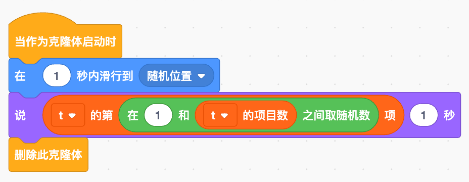

## Getting to Know Arcade

|        | Hardware                  |        | Hardware               |        | Hardware              |
| ------ | ------------------------ | ------ | --------------------- | ------ | -------------------- |
| **1**  | Ultra-thin joystick       | **2**  | 2.0-inch 320×240 HD color screen | **3**  | Game buttons (**A/B/X/Y**) |
| **4**  | Function buttons (**FN/BOOT**) | **5**  | Power button          | **6**  | MEMS microphone       |
| **7**  | Restart button            | **8**  | Multi-functional expansion port | **9**  | 2.5mm headphone jack  |
| **10** | Type-C USB               | **11** | Battery connector      | **12** | ESP32-S3 chip        |
| **13** | Wi-Fi / Bluetooth antenna |        |                       |        |                      |

We need to program the hardware using Scratch, entering the online programming environment from [BlockCode Playgrounds](https://make.blockcode.fun/) (an offline version will be available for download soon) —

This is a centralized programming learning environment that allows programming for various hardware. Here, we will start a new project from the "Scratch Programming Learning Machine" ——

### Rediscovering Scratch

You may have used Scratch, this incredible programming tool, or perhaps other modified graphical programming tools, or you may not have used any graphical tools at all. But that's okay; here we will reacquaint ourselves with Scratch. Scratch is a block-based programming tool developed by MIT's Lifelong Kindergarten group, aimed at teaching programming to children. It uses block-shaped pieces to represent statements in a program, and by assembling these blocks in an orderly manner, a program (script) is completed. This is very simple and easy for children to understand.

The Scratch programming tool we are using here is a new programming tool that closely resembles the original Scratch but has been slightly adjusted to work with Arcade hardware — for convenience, we still refer to it as Scratch, so whether or not you have encountered other Scratch-like programming tools, you can review it here.

|     | Area        | Description                                   |
| --- | --------- | --------------------------------------------- |
| 1   | Menu        | The editor menu for file operations and content editing, also allows switching system languages. |
| 2   | Project Name | The name of the currently edited project     |
| 3   | Editable Content Tabs | Switch between editable code, costumes (backgrounds), and sounds for the project. |
| 4   | Programming Blocks Area | All available programming blocks, divided into eight main categories[^1] and extension blocks. |
| 5   | Script Editing Area | The area for graphical programming, where programming blocks from the blocks area are dragged into the editor to create a program (script) in an orderly manner. |
| 6   | Stage (Simulator) Control | Control the operation and size of the stage (simulator). |
| 7   | Return to Home | Exit Scratch and return to the home page.   |
| 8   | Stage (Simulator) | Display of the stage (simulator), also the position editing area for characters. |
| 9   | Simulator Controller | Simulates the button controller on the learning machine. |
| 10  | Character Information Area | Displays and edits basic information about characters. |
| 11  | Character List | A list of all characters in the program (game). |
| 12  | Stage Background | Display and edit the stage background.      |
| 13  | Add Character | Button to add a character.                   |
| 14  | Add Background | Button to add a stage background.            |
| 15  | Add Extension Blocks | Open the extension blocks interface to add new programming blocks to the project. |

Here’s the translation while retaining the original format:

## Program Explanation

This tutorial briefly reviews the basic use of Scratch by creating a “Hello World” program, which is something every programming learner will do. Of course, ours will be a bit more beautiful, featuring a little cat happily spinning on the stage while continuously cloning itself. Each clone will run to different positions on the stage and say different greetings.

Based on the above requirements, we will break the entire program into three parts—

### Cat Program

This is the main part, responsible for initializing the cat and performing the cloning. Each clone is a clone of itself. For the “cat happily spinning,” we’ll make the cat face left at times and right at others.

### Greeting List

To allow each clone to say different greetings, we will create a greeting list[^2]—

The list can be named anything, including in Chinese. After creating this list, we will add some greetings to it at the start of the program. With this greeting list, we can have each clone randomly choose a greeting to say from the list.

### Clone Program

Finally, we will make each clone move as well. The action “clones will run to different positions on the stage” can be achieved with a block that says “glide to (any position) in (1) seconds.”

To make “clones also say different greetings,” we need a bit of skill. Using the greeting list we established earlier, we will use “pick a random number between (1) and (10)” to obtain an index for a greeting in the list. This index must exist—not exceed the number of greetings in the list—so the maximum number for the random pick must be specified as “(number of items in the list).”

**Finally, we must not forget to delete the clones** because the computer (hardware) has limited resources, allowing only 30 clones[^3], so unused clones must be deleted.

## Running and Debugging

Running the program on the simulator is very simple; just click the stage control  to see the effect. However, to run the program on Arcade, one more step is required—

### Downloading the Program

To run the program on Arcade, we need to download it to the device. First, use a Type-C data cable (it must support data transfer, not just charging) to connect the computer and the device. Then, click on the “Device” menu in the “Menu” and select the first item, “Download Program”—

In the pop-up device list window, select your device—“Arcade EDU (xxxxx)”, then click to connect and wait for the program to download completely. The entire download process may take varying amounts of time based on the number and size of resources used by the program, ranging from just a few seconds to 1–2 minutes. However, after the initial download is complete, updating the program will significantly shorten the download time, as unchanged resources and programs will not be re-downloaded; only new resources and programs will be downloaded.

Once the download is complete, the device will restart, and you can then select your own game to run. If you named the program before downloading, this name will be displayed at the top of the screen during selection. For specific device operations, you can refer to the “[User Manual](/en/os.md)”.

## Enhancements

Currently, the program only has a plain white background. You can try adding a background to make our program look more appealing. Additionally, when selecting the downloaded program on the device, programs with backgrounds will also be displayed, helping you better choose the correct program to run.

[^1]: Native Scratch has nine categories, but currently lacks the “Custom Blocks” category.

[^2]: Lists can be used to store a series of text or numerical data, with each data item accessible by its index.

[^3]: Native Scratch allows for 300 clones, but the Arcade hardware has fewer resources, so the allowable number is correspondingly lower.
