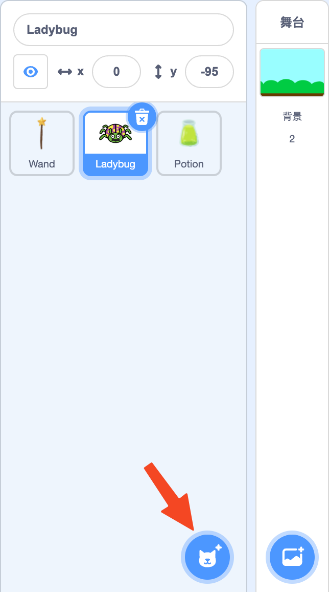
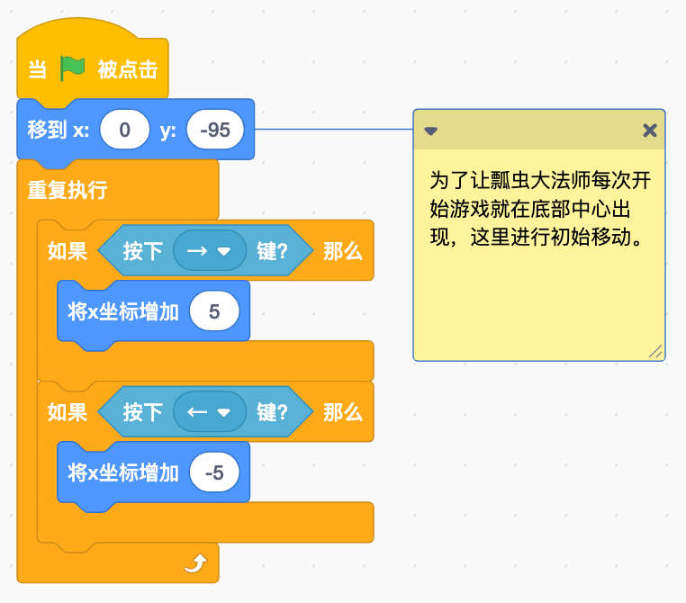
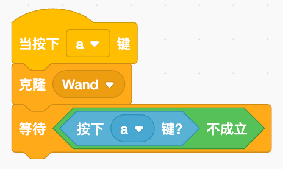
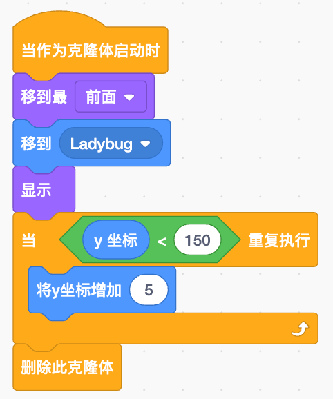
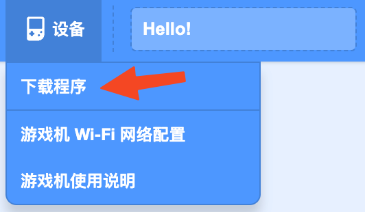

## Display

This is a ladybug mage, using a star wand to attack the potion bottles appearing in the sky! Only by shattering all the potion bottles can peace be restored to the world. — A classic game storyline, but of course, we are not here to focus on the story; we are going to learn how to create a mini-game based on this plot.

### Process Analysis

1. Potion bottles appear in six positions in the air, and the appearance of each bottle is random.
2. The ladybug mage can be controlled to move left and right.
3. By pressing a key, the star wand is fired; when the wand hits a potion bottle, the bottle immediately disappears.

The overall flow of the game is not difficult. Next, we will explain the program for each character step by step to complete the entire game process.

## Program Explanation

First, we add a background to our game — click the **Add Background** button and find "Blue Sky" to set it as the stage background; then delete the "Little Cat" character from the character list.

Next, we add three characters. Click the **Add Character** button and find the characters “Ladybug2,” “Wand,” and “Potion” to add them to the character list.

All the resources are ready, so we can start programming. Let's begin with the main character — the ladybug mage.

### Ladybug Mage Program

The ladybug mage has two tasks to perform:

1. Move left and right.
2. Fire the star wand.

#### Moving Left and Right

Movement is quite easy to implement. We control the ladybug's X coordinate (horizontal position) by continuously checking if the **⇦ key** or **⇨ key** is pressed — this allows for left and right movement. This program is straightforward and easy to write; it is a basic "repeat execution" + "if <> then" detection program.

Find the "Is key () pressed?" block in the sensing category and select either the **⇦ key** or **⇨ key**. The sensing block must be placed inside the "if <> then" block's pointed section, indicating a yes or no condition — if the corresponding key is pressed, then the character's X coordinate will change. Moving to the right increases the X coordinate, while moving to the left decreases it. Since there is no block for decreasing values, we will use a value-increasing block with a negative number to represent the decrease.

> Tip: To ensure the character "resets" every time the game starts, we will have an initialization program. Here, "go to x: () y: ()" serves as the initialization. Initialization usually occurs at the very beginning of the program, so it should be placed first (right after "when ![][] is clicked").#### Firing the Star WandWhile moving, we will fire the star wand every time the **A key** is pressed — use "create clone of ()" to generate a new wand, selecting "Wand" as the clone object. Additionally, continuous firing is not allowed; the wand can only be fired again after releasing the **A key**.

> Tip: After pressing a key, the "when [ ] key is pressed" event will repeatedly trigger. To prevent the star wand from firing continuously, we add a "wait ()" block after the clone — waiting for the key to be released. Since there is no block specifically for key release, we can use "not" + "is key () pressed?" to handle this, which will help avoid continuous firing of the star wand; it will only fire again when the key is pressed after being released.

### Star Wand Program

The star wand only appears and moves forward after it is fired. Each time it is fired, a clone is created, so we use the "when I start as a clone" event block to initiate the star wand's program.

When the clone starts, we first "bring the new clone to the front" to avoid being blocked by the ladybug mage. Then we "go to ()" the position of the ladybug mage, making it appear as though the cloned star wand is emitted by the ladybug. Next, we make the cloned star wand "show" itself, and then it moves upward. Here, we set a limit on the star wand's movement range, allowing it to move only when its height (Y coordinate) does not exceed 150. If it exceeds that, we simply "delete this clone" — if it goes off-screen and becomes invisible, we no longer need that clone.

> To ensure that the star wand does not appear before it is fired, we hide it during its initialization. 

### Potion Bottle Program

#### Arranging the Potion Bottles

Potion bottles will appear in the sky as soon as the program starts, and there will be six of them, evenly spaced. Therefore, we need to use "repeat () times" and "create clone of ()" to accomplish this repetitive task. After each clone, we will move it a fixed distance to the right — "change X by ()" — to ensure that each cloned potion bottle is spaced evenly apart.

#### Potion Bottle Disappearance

After cloning, we also need to change the appearance of the bottle, and it should disappear when hit by the star wand. Therefore, we will again use the "when I start as a clone" event block to complete these processes.

> Here, we make the clone disappear not by using the "hide" block, but by directly "deleting this clone," because once it disappears, this clone is no longer needed.

## Downloading the Program

Once all the programs are complete, run it on the simulator to check for any errors. If everything is working correctly, you can connect your computer and device using a Type-C data cable (it must be a data transfer cable, not just a charging cable). Then, click on the "Device" menu in the "Menu" section and select the first item, "Download Program" —

In the pop-up device list window, select your device — "Arcade EDU (xxxxx)" — and then click connect, waiting for the program download to complete. The entire download process may vary in duration due to factors such as the number and size of resources used in the program; it can take as little as ten seconds or as long as 1 to 2 minutes. However, after the first download is complete, updating the program will significantly shorten the download time, as unchanged resources and programs will not be redownloaded; only new resources and programs will be downloaded.

Once the download is complete, the device will restart, and you can then choose your own game to run. If you named the program before downloading, this name will be displayed at the top of the screen during selection. For specific device operations, you can refer to the "[User Manual]."(/en/os.md)”。

