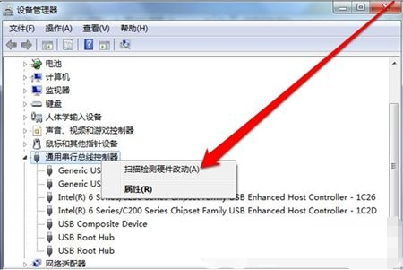

## USB驱动安装

安装USB驱动是使用外部设备时的关键步骤。从网站中下载驱动文件后，根据用户计算机系统选择安装步骤——

### Windows 10/11

无需要安装额外的驱动，即可正常使用。

### Windows 7

部分 Windows 7 系统下会因为缺少 USB 连接的驱动而导致无法通过USB线连接设备，可以参考下面步骤进行驱动的安装。

1. **识别设备**: 连接USB转串口适配器到计算机的USB端口，系统会尝试自动检测并安装驱动。如果未能成功，可以通过设备管理器，右键选择”扫描检测硬件改动“。查看未识别或带有黄色惊叹号的设备。

   

2. **下载驱动**: 由于Windows 7的内置驱动可能不支持所有USB转串口设备，因此需要从制造商官网下载合适的驱动程序。文件名可能是“USB驱动适合win7系统”这样的表述，这表明它是专为Windows 7优化的驱动。

3. **准备驱动**: 下载完成后，找到下载的驱动文件，将其解压，记住解压的文件夹路径，后面将需要用到。

4. **安装驱动**: 在设备管理器中，右键点击有感叹号的设备，选择更新驱动，然后选择“浏览我的电脑以查找驱动程序软件”。

   

   点击“让我从计算机上的可用驱动程序列表中选取”，

   

   点击“从磁盘安装”，在点击“浏览”

   

   找到解压文件夹中的\*.inf文件

   

   点击”确定“，”下一步“后等待安装完成。

5. **验证安装**: 安装完成后，重新检查设备管理器，确保USB转串口设备已正确识别并显示为COM端口。此时，应该可以使用串口通信软件（如HyperTerminal或RealTerm）与连接的设备进行通讯了。

### Linux

1. **下载驱动程序**：下载适用于Linux的驱动程序。

2. **连接设备**：将USB设备插入计算机的USB端口。

3. **安装驱动程序**：
   - 打开终端。
   - 使用命令行导航到下载的驱动文件夹。
   - 运行安装脚本或执行安装命令。
   - 如果需要，重启计算机。

### macOS

无需要安装额外的驱动，即可正常使用。

## 其他常见问题
