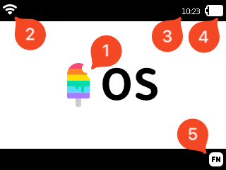
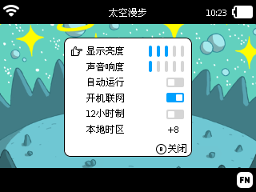
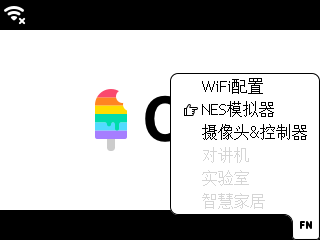
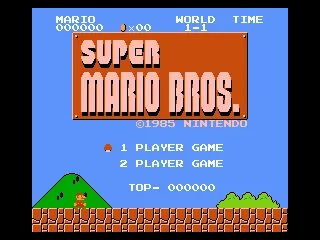
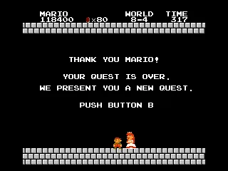

这是为[Arcade](https://arcade.blockcode.fun/)设计的一个操作系统，也将为了以后的系列产品服务。这个操作系统可以提供基本的作品程序管理以及系统功能的使用。

!> 系统软件功能更新迭代快，且针对不同版本硬件系统功能会有差异，该视频只作为操作系统效果展示。

## 特色

- **系统集成**：集成了多个子系统功能；
- **操作简单**：充分利用各个按键，直观简洁的操作方式；
- **作品管理**：对作品进行删除、运行等操作。

## 系统界面操作

|       | 功能                                                                                    |
| ----- | --------------------------------------------------------------------------------------- |
| **1** | 系统LOGO，有作品时将显示作品背景图片                                                    |
| **2** | 网络未连接/已连接提示图标                                                               |
| **3** | 当前时间（需网络连接后才显示）                                                          |
| **4** | 电池电量或充电提示图标                                                                  |
| **5** | 系统菜单按键提示图标，按下**FN键**显示[系统菜单](#%E7%B3%BB%E7%BB%9F%E8%8F%9C%E5%8D%95) |

### 作品管理

开机后进入系统操作界面，这里可以对用户下载的作品进行管理。

|       | 功能                                                                                 |
| ----- | ------------------------------------------------------------------------------------ |
| **1** | 当前作品背景图片                                                                     |
| **2** | 当前作品名称                                                                         |
| **3** | 多作品翻页提示，通过**⇦键**或**⇨键**切换作品                                         |
| **4** | [删除作品](#%E5%88%A0%E9%99%A4%E4%BD%9C%E5%93%81)操作提示，按**X键**可删除当前作品   |
| **4** | [运行作品](#%E8%BF%90%E8%A1%8C%E4%BD%9C%E5%93%81)操作提示，按**A键**立即运行当前作品 |

#### 下载作品

用户通过 [BlockCode Playgrounds](https://make.blockcode.fun/) 在线编程工具来完成编程作品的下载，首先开始新的《Scratch 编程学习机》作品（或者打开已经保存的作品），进入到图形编程工具的界面。

首先使用 Type-C 口的数据线（不能是只充电的充电线，必须是能进行数据传输的数据线）连接电脑和设备，然后点击“菜单”中的“设备”菜单，选择菜单的第一项“下载程序”——

在弹出的设备列表窗口中，选中你的设备——“Arcade EDU (xxxxx)”，然后点击连接，等待程序下载完成。整个下载过程会因程序使用的资源数量、尺寸等因素用时有所不等，快则十几秒，慢则1～2分钟。但在下载完成一次后，更新程序就会大大缩短下载时间，没有更改的资源和程序都不会重新下载，只会下载新的资源和程序。

下载完成后，设备会重新启动，之后就可以选择你自己的游戏运行了，如果在下载前先给程序命名了，选择时在屏幕的顶部会显示出这个名字。设备的具体操作可以查看“[操作手册](/zh-cn/os.md)”。

#### 删除作品

按下**X键**后，显示删除确认对话框，再按下**A键**确认删除，按**B键**取消删除，返回主界面（作品展示管理）。

#### 运行作品

在主界面下按下**A键**即可运行正在展示的作品。按下**A键**后，等待作品载入完成，就可以运行了。

### 系统菜单

系统子功能需要通过**FN按键**调出系统菜单后选择，后期还增加更多实用的系统功能。

|       | 功能                                             |
| ----- | ------------------------------------------------ |
| **1** | 当前选择菜单项提示，通过**⇧键**或**⇩键**切换选择 |
|       | 按下**A键**进入选中的菜单项功能                  |

### Wi-Fi配置

通过SmartConfig技术，快速的对[Arcade](https://arcade.blockcode.fun/)进行网络设置，让[Arcade](https://arcade.blockcode.fun/)连接上网络。进入Wi-Fi配置后，只需要使用微信扫描二维码，就可以开始进行配网，网络只支持**2.4G网络**。

微信扫描上面二维码，在打开的网页填入网络名和密码并确定开始配网，同时在[Arcade](https://arcade.blockcode.fun/)上按下**A键**等待配网完成。如果配网超时，可以按下**B键**后，再重新开始配网。

!> 离路由器近一点可以提高配网的成功率。

配置完成后，会将网络信息记录下来，下次就不需要再进行设置，开机就能连上网络。连网后系统系统会自动获取当前时间，并显示在右上角。当然也可以对自动联网和显示时间进行设置，关闭或开启都可以在系统设置或联网后设置。

| 设置     | 说明                                                                         |
| -------- | ---------------------------------------------------------------------------- |
| 开机联网 | 开机立刻连接上一次的网络，如果网络不可用则不联网。（默认开启）               |
| 12小时制 | 以12小时制显示当前时间。（默认关闭，以24小时制显示时间）                     |
| 本机时区 | 调整时区，将影响显示的时间。（默认为语言主要地区的时区，如，简体中文为+8区） |
| 重置网络 | 断开当前网络，删除保存的联网信息。                                           |

!> 也可以通过[BlockCode Playgrounds](https://make.blockcode.fun/)在电脑上设置[Arcade](https://arcade.blockcode.fun/)的网络，在下载程序后将连接到设置好的网络。

### 系统设置

设置[Arcade](https://arcade.blockcode.fun/)的音量、屏幕亮度、自动联网等个性化内容。

| 设置     | 说明                                                                         |
| -------- | ---------------------------------------------------------------------------- |
| 显示亮度 | 显示屏的亮度调整。（默认为3）                                                |
| 声音响度 | 声音的响度调整。（默认为3，为0时静音）                                       |
| 自动运行 | 开机自动运行最新下载的程序。开机时按住 **B键** 可跳过自动运行进入系统界面。  |
| 开机联网 | 开机立刻连接上一次的网络，如果网络不可用则不联网。（默认开启）               |
| 12小时制 | 以12小时制显示当前时间。（默认关闭，以24小时制显示时间）                     |
| 本机时区 | 调整时区，将影响显示的时间。（默认为语言主要地区的时区，如，简体中文为+8区） |

### FPV控制器

通过网络功能，将[Arcade](https://arcade.blockcode.fun/)作为无线控制器，可以接受图传画面显示和遥控设备，[Arcade](https://arcade.blockcode.fun/)上将显示摄像头所拍摄的画面。

### AI对讲机（计划中）

利用[Arcade](https://arcade.blockcode.fun/)内置的麦克风实现的语音功能。

#### 模式一（计划中）

短距离内多台机器的无线对讲功能。

#### 模式二（计划中）

AI语音助手，结合AI语言大模型，通过语音直接进行信息查询、翻译、问询等功能。

### 实验室（计划中）

在实验室里，通过参数配置，实现[Arcade](https://arcade.blockcode.fun/)对各种传感器以及电机调用，直观的获取传感器值。

---

（单击此处查看彩蛋）

## 彩蛋

最后还有一个彩蛋，可能大家在最前面的动画中有注意看到在**FN菜单**里面有一个“NES模拟器”，可是怎么没有介绍！是看错了吗？你没有看错，确实有NES模拟器功能，但是作为一款编程学习机，这个只是送给大家的一个小惊喜，通过[BlockCode Playgrounds](https://make.blockcode.fun/)上传NES游戏，才会激活这个功能。

在[BlockCode Playgrounds](https://make.blockcode.fun/)新建一个**Scratch Arcade**作品，然后添加扩展。在扩展的搜索栏中输入“**nes**”（必须是完整的三个字母）就可以查看到“NES模拟器”的扩展，添加后会出现在积木栏中。

 

这个扩展没有任何积木，只有一个“下载ROM到游戏机”的按钮，点击按钮后连接Arcade，并选择要玩的游戏ROM，就可以在**FN菜单**中打开“NES模拟器”，选择刚下载的游戏ROM就可以开始玩了。需要注意“NES模拟器”的按键和原本的键位稍有不同：

| NES按键    | Arcade按键 |
| ---------- | ---------- |
| ⬆         | ⇧          |
| ⬇         | ⇩          |
| ⬅         | ⇦          |
| ⮕          | ⇨          |
| **A**      | **B**      |
| **B**      | **A**      |
| **START**  | **FN**     |
| **SELECT** | **X**      |
| **RESET**  | **Y**      |

!> 游戏ROM请自行查找下载或咨询客服。

