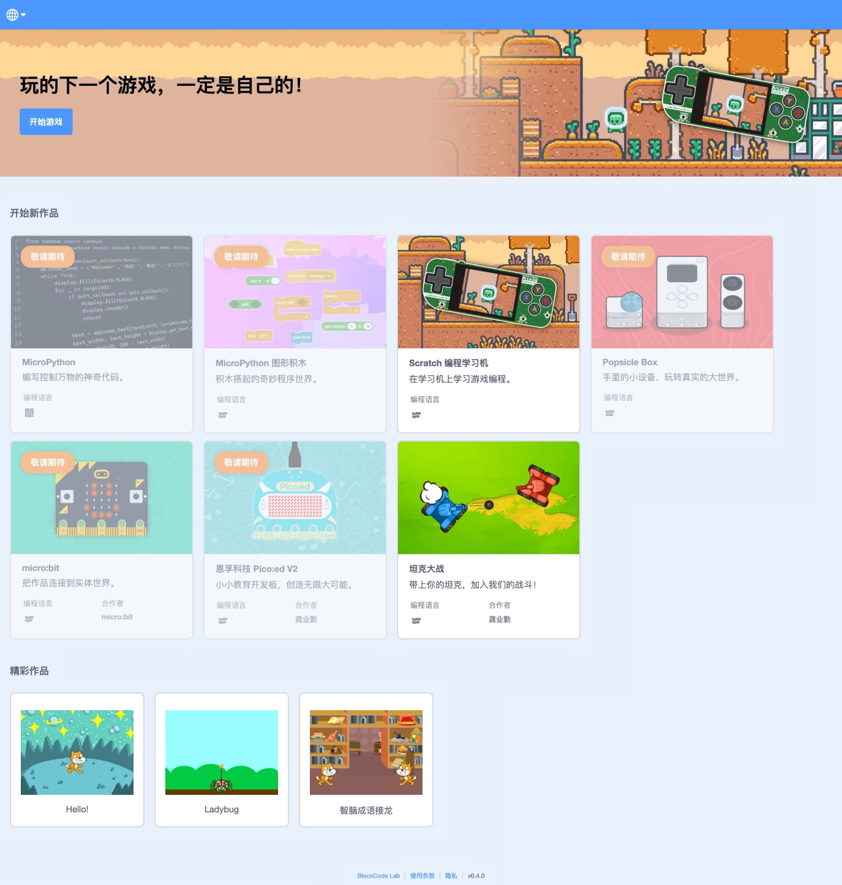

教程针对有 Scratch 图形编程和具有编程知识的学生和创客爱好者，通过特色教程，让您能快速上手我们的产品。

## 图形化编程（Scratch）

用户通过 [BlockCode Playgrounds](https://make.blockcode.fun/) 在线编程工具来完成编程作品的下载，首先开始新的《编程学习机》作品（或者打开已经保存的作品），进入到图形编程工具的界面。

### 下载作品

首先使用 Type-C 口的数据线（不能是只充电的充电线，必须是能进行数据传输的数据线）连接电脑和设备，然后点击“菜单”中的“设备”菜单，选择菜单的第一项“下载程序”——

在弹出的设备列表窗口中，选中你的设备——“Arcade EDU (xxxxx)”，然后点击连接，等待程序下载完成。整个下载过程会因程序使用的资源数量、尺寸等因素用时有所不等，快则十几秒，慢则1～2分钟。但在下载完成一次后，更新程序就会大大缩短下载时间，没有更改的资源和程序都不会重新下载，只会下载新的资源和程序。

下载完成后，设备会重新启动，之后就可以选择你自己的游戏运行了，如果在下载前先给程序命名了，选择时在屏幕的顶部会显示出这个名字。设备的具体操作可以查看“[操作手册](/zh-cn/os.md)”。

### 运行作品

在主界面下按下**A键**即可运行正在展示的作品。按下**A键**后，等待作品载入完成，就可以运行了。

### 删除作品

按下**X键**后，显示删除确认对话框，再按下**A键**确认删除，按**B键**取消删除，返回主界面（作品展示管理）。

### 清除所有作品

用户通过 [BlockCode Playgrounds](https://make.blockcode.fun/) 在线编程工具实现清楚设备中所有作品的功能。首先开始新的《Scratch 编程学习机》作品（或者打开已经保存的作品），进入到图形编程工具的界面。

首先使用 Type-C 口的数据线（不能是只充电的充电线，必须是能进行数据传输的数据线）连接电脑和设备，然后点击“菜单”中的“设备”菜单，选择菜单的第四项“清除所有作品”——

在弹出的设备列表窗口中，选中你的设备，然后点击连接，等待程序清除完成。

## 固件

### 升级固件

同上，用户通过 [BlockCode Playgrounds](https://make.blockcode.fun/) 在线编程工具实现清楚设备中所有作品的功能。选择第五项“升级固件”。

注意：用户在升级的同时，若需要清除设备中所有作品，则选择第六项“还原固件”。后续操作相同。

在弹窗中选择“下载”按钮，进入固件发行网站——

选择最新版本，点击后自动下载到本地默认位置。

根据提示操作设备后，选择下载的.bin文件，等待程序升级完成。

## 教程

> 8节教程免费领取。

|     | 教程                                      | 介绍                                                                         |
| --- | ----------------------------------------- | ---------------------------------------------------------------------------- |
| 1   | [你好 Arcade](/zh-cn/tutorials/tutor1.md) | 认识 Arcade，学习使用 Scratch 编写简单的程序并掌握如何下载程序到硬件中运行。 |
| 2   | [瓢虫大法师](/zh-cn/tutorials/tutor2.md)  | 制作多角色互动的小游戏，学习硬件按钮的控制程序。                             |
| 3   | 敬请期待                                  |                                                                              |
| 4   | 敬请期待                                  |                                                                              |
| 5   | 敬请期待                                  |                                                                              |
| 6   | 敬请期待                                  |                                                                              |
| 7   | 敬请期待                                  |                                                                              |
| 8   | 敬请期待                                  |                                                                              |
