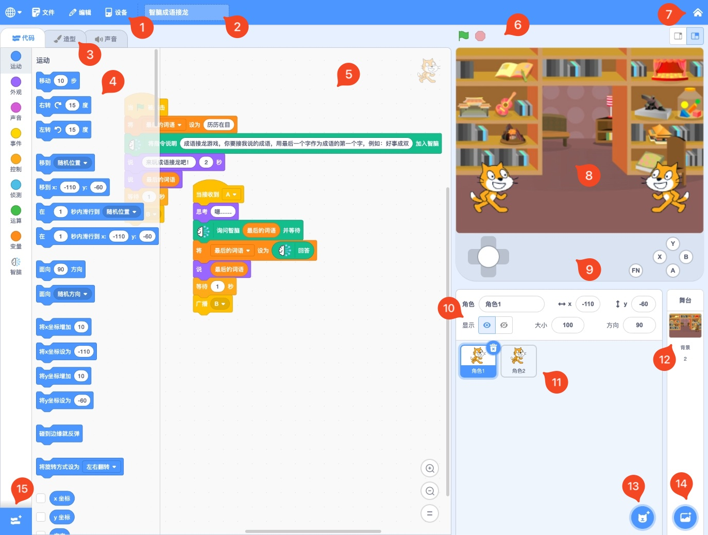
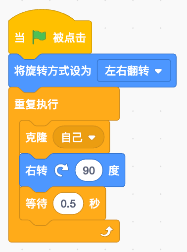

## 初识 Arcade

|        | 硬件                   |        | 硬件                |        | 硬件                |
| ------ | -------------------- | ------ | ----------------- | ------ | ----------------- |
| **1**  | 超薄摇杆                 | **2**  | 2.0寸 320×240 高清彩屏 | **3**  | 游戏按钮（**A/B/X/Y**） |
| **4**  | 功能按钮（**FN/BOOT**）    | **5**  | 电源按钮              | **6**  | MEMS 麦克风          |
| **7**  | 重启按钮                 | **8**  | 多功能扩展口            | **9**  | 2.5mm 耳机口         |
| **10** | Type-C USB           | **11** | 电池接口              | **12** | ESP32-S3 芯片       |
| **13** | Wi-Fi / Bluetooth 天线 |        |                   |        |                   |

我们需要通过 Scratch 来对硬件进行编程，从 [BlockCode Playgrounds](https://make.blockcode.fun/) 进入到线上编程环境（离线版很快也将提供下载）——

这是一个集中编程学习环境，可以对多种硬件进行编程，这里我们需要从《Scratch 编程学习机》开始新的作品——

### 重拾 Scratch

或许你用过 Scratch 这款神器的编程工具，或许你用过其他神改的图形编程工具，或许你什么图形工具都没有用过。不过没关系，在这里我们重新认识一下 Scratch。Scratch 是 MIT 的终身幼儿园小组开发的一款面向儿童学习编程的积木式拼搭编程工具，采用类似积木的形状来表示程序中的语句，将这些积木形状有序的组合在一起，就完成了一个程序（脚本），这很简单，很适合小朋友的理解。

这里我们使用的 Scratch 编程工具是接近原生 Scratch 但进行了细微调整后的能结合 Arcade 硬件的新编程工具——为了方便我们依然称为 Scratch，所以不管你有没有接触过其他 Scratch 类编程工具，都可以再回顾一下。

|     | 区域        | 说明                                        |
| --- | --------- | ----------------------------------------- |
| 1   | 菜单        | 编辑器的菜单，可以进行文件操作和内容编辑等，还可以切换系统语言。          |
| 2   | 项目名       | 当前编辑的项目名称                                 |
| 3   | 编辑内容切换标签  | 对项目可编辑的代码、造型（背景）和声音进行切换。                  |
| 4   | 编程积木区     | 所有可用的编程积木，分为八大类[^1]和扩展积木。                 |
| 5   | 程序（脚本）编辑区 | 进行图形编程的区域，将积木区的编程积木拖入编辑器，有序的组合就形成了程序（脚本）。 |
| 6   | 舞台（模拟器）控制 | 控制舞台（模拟器）的运行和大小尺寸。                        |
| 7   | 返回首页      | 退出 Scratch 返回到首页。                         |
| 8   | 舞台（模拟器）   | 舞台（模拟器）展示，也是角色的位置编辑区。                     |
| 9   | 模拟控制器     | 模拟学习机上的按键控制器。                             |
| 10  | 角色信息区     | 角色的基础信息显示和编辑区。                            |
| 11  | 角色列表      | 程序中（游戏）的所有角色列表。                           |
| 12  | 舞台背景      | 舞台背景的展示和编辑。                               |
| 13  | 添加角色      | 添加角色的按钮。                                  |
| 14  | 添加背景      | 添加舞台背景的按钮。                                |
| 15  | 添加扩展积木    | 打开扩展积木界面，添加新编程积木到项目中。                     |

## 程序讲解

本节教程只是回顾一下 Scratch 的基本使用，做一个所有编程学习都会要做的“Hello World”程序。当然我们的会更漂亮一点，将会有一个小猫在舞台上开心转圈圈，同时不断的分身，分身会跑向舞台的不同位置，每个分身还会说出不同的问候语。

根据上述需求，我们将整个程序拆解为三个部分——

### 小猫程序

这是主要的部分，负责小猫的初始化以及进行克隆，每个分身就是对自己的一次克隆。“小猫开心的转圈圈”我们就让小猫可以一会面朝左，一会面朝右。

### 问候语列表

为了让每个分身能说不同的问候语，我们建立一个问候语列表[^2]——

列表可以任意取名，中文名也可以。建立这个列表后，在程序开始时，将一些问候语添加到列表中。有了这个问候语列表，我们可以让每个分身从这个列表中任选一句问候语来说。

### 分身程序

最后我们让每个分身也动起来，“分身会跑向舞台的不同位置”这只需要一个“在(1)秒内滑行到(任意位置)”的积木就可以实现。

然后实现“分身还会说出不同的问候语”，这个就需要一点技巧了，前面我们已经建立的问候语列表，为了能在列表中的任选一句问候语，我们需要使用“在(1)和(10)之间取随机数”得到一个列表中问候语的序号，这个序号必须是存在的——不能超过列表中问候语的个数——所以我们取随机数的最大数字就需要指定为“(列表)的项目数”。

**最后我们不能忘记把分身（克隆体）删除**，因为计算机（硬件）资源有限，只能允许存在 30 个克隆体[^3]，所以不用的克隆体一定要删除。

## 运行调试

在模拟器上运行程序很简单，只要点击舞台控制的  就可以看到效果，但是要在 Arcade 上运行编好的程序还需要再多完成一步——

### 下载程序

为了让程序在 Arcade 上运行，我们需要将程序下载到设备上，首先使用 Type-C 口的数据线（不能是只充电的充电线，必须是能进行数据传输的数据线）连接电脑和设备，然后点击“菜单”中的“设备”菜单，选择菜单的第一项“下载程序”——

在弹出的设备列表窗口中，选中你的设备——“Arcade EDU (xxxxx)”，然后点击连接，等待程序下载完成。整个下载过程会因程序使用的资源数量、尺寸等因素用时有所不等，快则十几秒，慢则1～2分钟。但在下载完成一次后，更新程序就会大大缩短下载时间，没有更改的资源和程序都不会重新下载，只会下载新的资源和程序。

下载完成后，设备会重新启动，之后就可以选择你自己的游戏运行了，如果在下载前先给程序命名了，选择时在屏幕的顶部会显示出这个名字。设备的具体操作可以查看“[操作手册](/zh-cn/os.md)”。

## 提高

现在的程序只有一片白色的背景，可以试着通过“添加背景”来让我们的程序呈现更美观。并且在设备上，选择下载好的程序时，有背景的程序也会展示出来，更好的帮助你选择正确的要运行的程序。

[^1]: 原生 Scratch 有九大类，目前暂缺“自制积木”这一个种类。

[^2]: 列表可以用来储存一连串的文字或数字数据，每个数据都可以通过序号来获取。

[^3]: 原生 Scratch 中允许有 300 个克隆体，但是 Arcade 硬件资源更少，所以允许的数量也相应更少。
