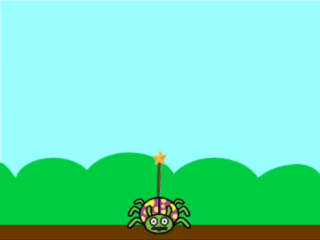
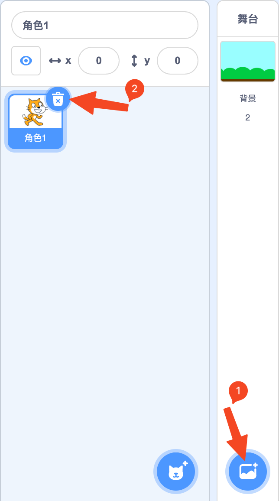
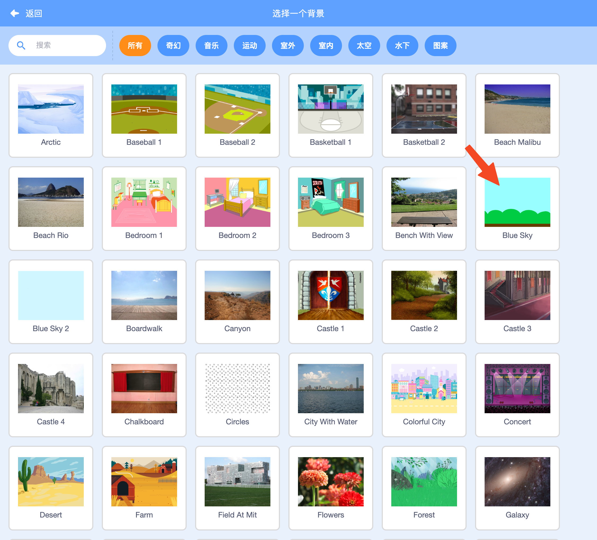
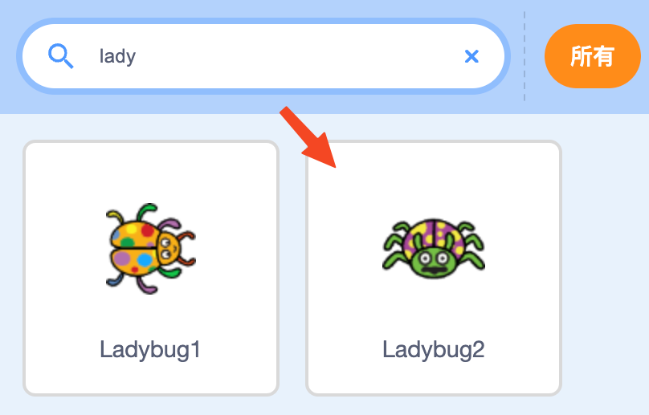
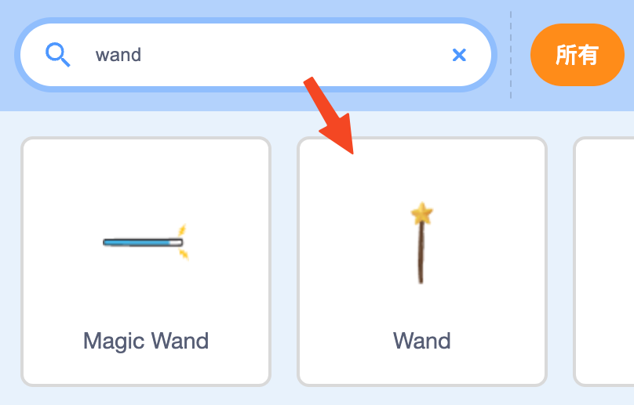
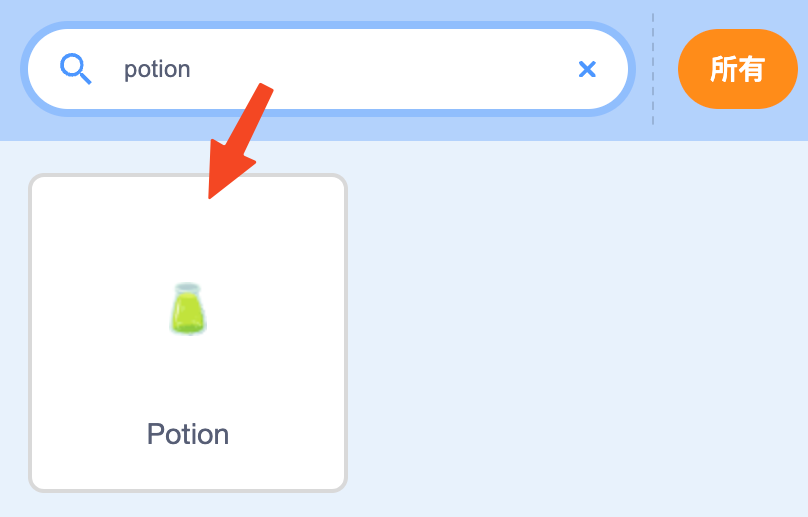
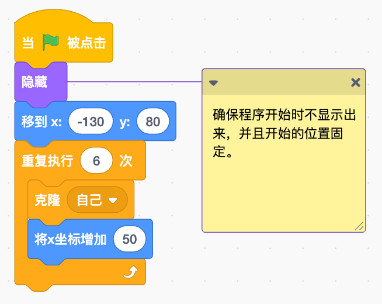
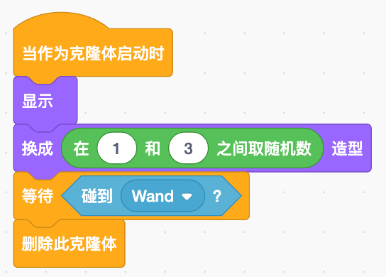

## 项目展示

这是一位瓢虫大法师，它正在使用星星法杖攻击天空中出现的魔药瓶！只有把所有魔药瓶都击碎才能恢复世界的和平。——一个老套的游戏剧情，当然我们不是看游戏剧情，我们还是来学习如何根据这个游戏剧情来制作一个小游戏。

### 流程分析

1. 魔药瓶在空中六个位置出现，并且每次出现的瓶子样子随机；
1. 可以左右控制瓢虫大法师的移动；
1. 通过按键来发射星星法杖，法杖在碰到魔药瓶后，魔药瓶立即消失。

整个游戏的流程并不难，接下来我们就一一对每个角色的程序进行讲解，完成整个游戏流程。

## 程序讲解

首先我们给我们的游戏里添加一个背景——通过**添加背景**按钮，找到“Blue Sky”添加为舞台背景；然后删除角色列表中的“小猫咪”的角色。

接下来我们添加三个角色，点击**添加角色**按钮，找到“Ladybug2”、“Wand”和“Potion”三个角色添加到角色列表中。

所有的资源准备就绪，我们就可以开始进行编程了，我们就从主角——瓢虫大法师开始讲解程序——

### 瓢虫大法师程序

瓢虫大法师有两件事情要做：

1. 左右移动；
1. 发射星星法杖。

#### 左右移动

移动很好实现，我们通过不断侦测是否按下**⇦键**或**⇨键**来控制瓢虫的X坐标（横坐标）——左右移动，这段程序很好理解，也很好编写，这是一个基本的“重复执行” + “如果\<>那么”的检测程序。

在侦测类编程积木中找到“按下()键？”积木，选择**⇦键**或**⇨键**。侦测积木必须放在“如果\<>那么”积木的尖头框内，表示的是或否——如果是按下了对应的按键，那么就改变角色的X坐标。往右是X坐标增加，往左是X坐标减少——积木中没有数值减少型的积木，所以我们用数值增加型积木填入一个负值来表示减少。

> 小技巧：为了让角色每次开始游戏的时候都“复位”，我们会有初始化程序，这里的“移到 x:() y:()”就是初始化。初始化通常是在程序最开始的时候进行，所以放在最前面（紧接“当被点击”）。

#### 发射星星法杖

在移动的同时，我们每次按下**A键**就发射星星法杖——使用“克隆()”来生成一个新的法杖，选择“Wand”作为克隆对象。并且不允许连续发射，只能在松开**A键**后才能再次发射。

> 小技巧：按下按键后，会重复触发“当按下\[\]键”事件，为了不连续发射星星法杖，所以我们在克隆后加上一个“等待\<>”积木——等待松开按键——没有松开按键的积木可以用“不成立” + “按下()键？”来处理，这样就可以避免连续发射星星法杖，只有松开按键后再次按下才发射。

### 星星法杖程序

星星法杖只有在发射后才会出现并往前移动，每次发射都是克隆了一次，产生了一个克隆体，所以我们用“当作为克隆体启动时”事件积木来开始星星法杖的程序。

当克隆体启动后，首先我们将新的克隆体“移到最\[前面\]”，避免被瓢虫大法师挡住。然后将克隆体“移到()”瓢虫大法师的位置，让克隆的星星法杖像是由瓢虫发出的。接着将克隆的星星法杖“显示”出来，之后就是向上移动了。这里我们限定星星法杖移动的一个范围，只允许它在高度（Y坐标）不超过150的时候移动，超过了就直接“删除此克隆体”——超出屏幕范围看不见就不再需要这个克隆体了。

> 为了保证星星法杖在发射前不会显示出来，我们在初始化星星法杖时，就将它隐藏起来。 

### 魔药瓶程序

#### 排列魔药瓶

魔药瓶会在程序开始后就出现在天空中，并且会出现6个，并且间距相等。所以我们需要用“重复执行()次”和“克隆()”来完成这个重复性的工作，并且每次克隆后都会固定往右移动——“将X坐标增加()”一定距离，保证每个克隆出来的魔药瓶间隔距离相等。

#### 魔药瓶消失

克隆出来后还要改变瓶子造型，并且在被星星法杖击中后要消失，所以我们再次使用“当作为克隆体启动时”事件积木来完成这些流程。

> 这里我们让克隆体消失不是用“隐藏”积木，而是直接“删除此克隆体”，因为消失后这个克隆体就不再需要了。

## 下载程序

完成所有程序后，现在模拟器上运行一下，检查程序的错误，如果一切都正常，那么可以使用 Type-C 口的数据线（不能是只充电的充电线，必须是能进行数据传输的数据线）连接电脑和设备，然后点击“菜单”中的“设备”菜单，选择菜单的第一项“下载程序”——

在弹出的设备列表窗口中，选中你的设备——“Arcade EDU (xxxxx)”，然后点击连接，等待程序下载完成。整个下载过程会因程序使用的资源数量、尺寸等因素用时有所不等，快则十几秒，慢则1～2分钟。但在下载完成一次后，更新程序就会大大缩短下载时间，没有更改的资源和程序都不会重新下载，只会下载新的资源和程序。

下载完成后，设备会重新启动，之后就可以选择你自己的游戏运行了，如果在下载前先给程序命名了，选择时在屏幕的顶部会显示出这个名字。设备的具体操作可以查看“[操作手册](/zh-cn/os.md)”。

